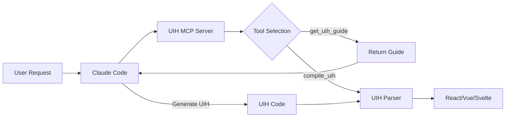

# UIH MCP Server

MCP (Model Context Protocol) server for UIH - enables Claude Code to generate UI components using the UIH language natively.

## What This Does

This MCP server allows Claude Code to:
- **Get UIH language guide** - Learn UIH syntax and generate code directly
- **Compile UIH** to React, Vue, or Svelte components

**No API Key Required!** Claude Code generates UIH code directly using its own capabilities.

## Installation

### Option 1: Use from this repository (Development)

```bash
# Build the MCP server
pnpm --filter uih-mcp-server build
```

### Option 2: Install from npm (Coming Soon)

```bash
npm install -g uih-mcp-server
```

## Configuration

### For Claude Code

Add this to your Claude Code MCP settings (`~/.claude/mcp_settings.json`):

```json
{
  "mcpServers": {
    "uih": {
      "command": "/absolute/path/to/uih/packages/mcp-server/bin/uih-mcp-server.js"
    }
  }
}
```

**Important**:
- Replace `/absolute/path/to/uih` with the actual path to this repository
- Make sure `bin/uih-mcp-server.js` has execute permissions (`chmod +x`)
- **No API key needed!** Claude Code generates UIH code directly

**Example for your system**:
```json
{
  "mcpServers": {
    "uih": {
      "command": "/Users/jaewonlee/Documents/CODESBYLEEJAEWON/uih/packages/mcp-server/bin/uih-mcp-server.js"
    }
  }
}
```

## Available Tools

### 1. `get_uih_guide`
Get UIH language syntax guide and examples. Claude Code reads this guide and generates UIH code directly.

**Parameters**:
- `section` (optional): Which section to retrieve (`full`, `syntax`, `examples`, `components`, `styling`)

**Example**:
```
Claude Code: [uses mcp__uih__get_uih_guide]
section: "full"
→ Returns comprehensive UIH guide
→ Claude Code generates UIH code based on the guide
```

### 2. `compile_uih`
Compile UIH code to React, Vue, or Svelte with optional interactive templates.

**Parameters**:
- `uih_code` (required): UIH code to compile
- `target` (optional): Target framework (`react`, `vue`, `svelte`). Default: `react`
- `interactive` (optional): Generate interactive template with logic placeholders. Default: `false`
- `features` (optional): Specific features to generate placeholders for: `["validation", "api", "animation", "modal", "tabs"]`
- `output_file` (optional): File path to save the generated component

**Interactive Mode**:
When `interactive: true`, the compiler automatically:
- Detects forms, inputs, buttons, modals, and tabs in your UIH code
- Generates smart placeholders with 🤖 TODO comments
- Injects state management (`useState`), validation logic, submit handlers, and input change handlers
- Creates a hybrid template: UIH generates structure → Claude Code implements logic

**Example (Basic)**:
```
Claude Code: [uses mcp__uih__compile_uih]
uih_code: "meta { route: \"/login\"; } ..."
target: "react"
output_file: "src/components/Login.tsx"
```

**Example (Interactive)**:
```
Claude Code: [uses mcp__uih__compile_uih]
uih_code: "meta { route: \"/login\"; } layout { Form { Input(id:\"email\", type:\"email\") ... } }"
target: "react"
interactive: true
output_file: "src/components/Login.tsx"

→ Generates React component with:
  - useState for form data, errors, loading state
  - validateForm() with email/password validation
  - handleSubmit() with API call skeleton
  - handleInputChange() with error clearing
  - 🤖 TODO comments for Claude Code to complete
```


## Usage in Claude Code

Once configured, Claude Code will automatically discover and use these tools:

### Example 1: Generate a basic component
```
You: "Create a login form component with UIH"

Claude Code:
  [Reads UIH guide with mcp__uih__get_uih_guide]
  → Generates UIH code directly
  → Compiles with mcp__uih__compile_uih
  → Saves to src/components/login-form.tsx

  "✅ Created login-form.tsx in src/components/"
```

### Example 2: Generate with interactive template (2-stage workflow)
```
You: "Create a login form with validation and API integration"

Claude Code:
  [Reads UIH guide with mcp__uih__get_uih_guide]
  → Generates UIH code with Form and Inputs
  → Compiles with mcp__uih__compile_uih (interactive: true)
  → Detects form features automatically
  → Injects smart placeholders with 🤖 TODO comments
  → Implements the logic based on placeholders
  → Saves completed component to src/components/login-form.tsx

  "✅ Created interactive login form with validation and API integration!"
```

### Example 3: Compile existing UIH
```
You: "Compile examples/booking.uih to Vue"

Claude Code:
  [Reads examples/booking.uih]
  [Uses mcp__uih__compile_uih with target: "vue"]
  → Compiles to Vue
  → Saves to out/booking.vue

  "✅ Compiled to Vue: out/booking.vue"
```

## How It Works



## Comparison: With vs Without MCP

### Without MCP (Manual)
```bash
# Step 1: Generate UIH
node packages/cli/dist/index.js ai "login form" > login.uih

# Step 2: Compile to React
node packages/cli/dist/index.js compile login.uih out --target react

# Step 3: Move to project
cp out/login.tsx src/components/
```

### With MCP (Automatic)
```
You: "Create a login form component"
Claude Code: [Automatically does all 3 steps] ✅ Done!
```

## Benefits

✅ **Seamless Integration**: Claude Code discovers tools automatically
✅ **Single Command**: Generate and compile in one step
✅ **Type Safe**: Full TypeScript support with schema validation
✅ **Error Handling**: Clear error messages and validation
✅ **Flexible**: Use individual tools or complete workflow

## Troubleshooting

### MCP Server Not Found
- Check `~/.claude/mcp_settings.json` syntax
- Verify the absolute path to `dist/index.js`
- Restart Claude Code after configuration changes

### Build Errors
- Run `pnpm install` in the repository root
- Run `pnpm build` to rebuild all packages
- Check that all workspace dependencies are installed

## Development

### Building
```bash
pnpm --filter uih-mcp-server build
```

### Testing Locally
```bash
# Run the MCP server directly
node packages/mcp-server/dist/index.js
```

### Debugging
The MCP server logs to stderr, which is visible in Claude Code's MCP logs.

## Architecture

```
packages/mcp-server/
├── src/
│   └── index.ts          # MCP server implementation
├── dist/                 # Built output (ESM)
├── package.json          # Dependencies and scripts
├── tsconfig.json         # TypeScript configuration
└── tsup.config.ts        # Build configuration
```

**Dependencies**:
- `@modelcontextprotocol/sdk` - MCP protocol implementation
- `uih-parser` - UIH language parser
- `uih-codegen-react` - Multi-framework code generator

## License

MIT

## Related

- [UIH Language Documentation](../../docs/LANGUAGE.md)
- [UIH CLI](../cli/)
- [UIH Parser](../parser/)
- [MCP Protocol Specification](https://modelcontextprotocol.io/)
